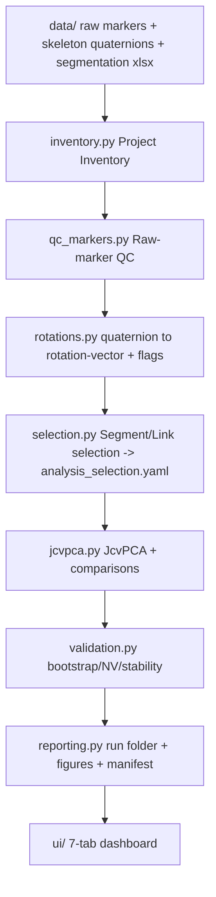

# Gaga JcvPCA — Clean Standalone Rebuild (Master Plan)

This plan is the specification for a NEW standalone project folder (`gaga_jcvpca/`) that replaces the current five-package repo (`Layer1..Layer3`, `Dashboard/`, scattered `src/`, `scripts/`) with a slim, decision-focused, scientifically faithful pipeline. Per confirmed decisions: (1) port the proven scientific core byte-faithful and rewrite everything else clean; (2) build it as a fully standalone project with its own copy of data and configs.

The single master Markdown deliverable (`gaga_jcvpca/docs/MASTER_PLAN.md`) will contain all 19 sections requested. This plan document is the outline and authoritative content for that file.

---

## 0a. Resolved decisions (fixed implementation guidance)

These six decisions are fixed unless a later scientific review shows a serious reason to revise them. They resolve most of the former open questions.

1. **Variance threshold / selected_m** — Default `variance_threshold = 0.80` (canonical-batch compatible). Exposed in config AND the Analysis Setup UI; logged in every run; `selected_m` reported per comparison; never silently changed between runs. Add an optional diagnostic that sweeps candidate thresholds (e.g. 0.70/0.80/0.90) and reports how `selected_m` and link/region results shift, recommending a value from explained-variance stability + result robustness.
2. **671 T3 marker-set difference** — Do NOT hard-block T1-vs-T3 on prefix difference alone. Emit a comparability warning + log entry, record the marker-set difference in `reproducibility_manifest.json`, surface it in the QC/analysis-readiness UI, and carry it into result interpretation text. If features are not comparable, restrict to the shared valid link intersection and log exactly which links were included/excluded.
3. **Scope = P1 / Task Part 1 only** — V1 supports JcvPCA only for Task Part 1 data (full segmentation set). Architecture is extensible to more task parts, but Task Part 2 is NOT wired in V1. Naming must make "P1 = Task Part 1" unmistakable versus Gaga aliases `P1–P5` and canonical `exNN`. **The segmentation workbook `exercise_id` column is authoritative for exercise identity** (confirmed values 1–17, 1-indexed, in `{pid}_ex_segmentatios_frames.xlsx`; canonical label = `ex{exercise_id:02d}`). The system reads `exercise_id` from the xlsx rather than assuming a fixed count or `ex00` origin.
4. **Participant-specific by default** — All primary analyses are per-participant (separate JcvPCA results, NV baseline, validation, interpretation). No cohort merging in V1. Cross-participant comparison exists ONLY as an optional, clearly-labeled exploratory UI mode using the shared valid link intersection; never treated as population inference. Every run logs included links and excluded links with reasons.
5. **QC blocking vs soft-warning + smoothing controls** — Fixed hard-block and soft-warning lists (Section 7). Filter/smoothing parameters (cutoff frequency, filter settings) are config-stored, UI-editable before rotation-vector computation, logged per run, and changing them triggers recomputation or a clearly-marked new cached rotvec output.
6. **Statistical validation = optional post-analysis stage** — Per-participant JcvPCA results are produced first; validation is a separate optional stage that runs only when data is sufficient and comparable, otherwise says so plainly. Method choice is Fable's recommendation (Section 11), and every validation conclusion carries an explicit strength label (`descriptive only` / `bootstrap-supported` / `permutation-supported` / `sensitivity-supported` / `insufficient data`). All conclusions stay participant-specific in V1.

---

## 0. What "port faithfully" vs "rewrite clean" means

Keep byte-faithful (numbers must not change vs the validated pipeline):
- `compute_jcvpca()` sequence: center A independently → `PCA(selected_m).fit(A)` → center B independently → `B_proj = B_centered @ pca_A_frame.T` → `PCA(selected_m).fit(B_proj)` → `B_reproj = pca_B_frame @ pca_A_frame` → `JcvPCA_axis = |B_reproj| - |A|`. No z-score, no variance scaling, no `PCA_A.transform(B_raw)`. Source: `Layer3_JcvPCA/src/layer3_jcvpca/core.py`.
- `selected_m` rule: smallest m with cumulative EVR of independently-centered A >= `variance_threshold`; chosen from A only. Source: `core.select_selected_m_from_A`.
- Link RSS aggregation: `JRW_link = sqrt(sum over rx,ry,rz of loading^2)`, `JcvPCA_link = JRW_B - JRW_A`. Source: `aggregation.aggregate_axis_to_link_rss`.
- Quaternion→rotation-vector conversion: `scipy.spatial.transform.Rotation.from_quat([x,y,z,w]).as_rotvec()`; relative link rotation `inv(q_parent) * q_child`; sign-continuity; Butterworth low-pass in tangent space. Source: `Layer2_Motive_Kinematics/src/layer2_motive/rotvec.py` and Stage 06/07/08.
- Golden regression tests carried over verbatim (`test_core_matches_paper_logic.py`, `test_core_golden_regression.py`) so ported math is provably identical.

Rewrite clean (no legacy carried over):
- Discovery/inventory, naming unification, QC presentation, segment/link selection, batch orchestration, request format, validation module, reporting, and the entire dashboard.

---

## 1. Executive summary (for MASTER_PLAN.md)

- The project answers one scientific question with JcvPCA: for a participant, do body links contribute differently to shared movement-variance structure at T2/T3 vs the T1 reference, and is any change larger than the natural R1-vs-R2 repetition variability at T1.
- Current reality: 2 participants (`671`, `252`), timepoints T1/T2/T3, Task Part 1 (P2 exists in raw for 252 but is unwired), repetitions R1/R2, 17 transcript exercises grouped into 6 movement groups; Group 4 (curvilinear exploration, exercises 9–13) is the primary analysis unit.
- The existing system is scientifically sound at its core but operationally heavy: dual GUIs, ~9,900 files per batch, uniform "warning" QC that lost meaning, a 0.80-vs-0.90 variance-threshold split, and three overlapping "P" naming namespaces.
- The new project keeps the sacred math, unifies naming, turns QC into research-language decisions, adds a proper natural-variability / bootstrap validation layer, and presents everything through a 7-tab decision dashboard backed by ~10 source modules.

## 2. Current project problems (evidence-based)

- Naming collision across three namespaces: session-key `P1` = Task Part 1; Gaga `P1`–`P5` = exercises 9–13 inside Group 4; `ex01`–`ex17` = transcript exercises. A researcher cannot tell if `P1` and `ex01` refer to the same thing.
- QC that does not inform decisions: 72/72 (and 34/36 for 252) exports flagged `qc_status=warning` while also `layer3_safe=true`; severity is undifferentiated, so warnings are ignored.
- Silent scientific confounds: participant 671 T3 uses marker-asset prefix `T3_671:` vs `671:`, and Layer 1 does not detect cross-session marker-set identity — cross-timepoint JcvPCA can be comparing different skeletons.
- Parameter fragility: `variance_threshold` is 0.90 in `layer3_config.yaml`/`core.py` defaults but 0.80 in the canonical batch/`analysis_params.yaml`; feature manifests differ (671 = 14 links, 252 = 16 links); config edits "mirror" Python constants but do not always change runtime.
- Output sprawl and duplication: two JcvPCA implementations (monolithic + workbench), two runners, many near-duplicate report scripts, ~1,500-line batch runner, and analysis-request YAMLs thousands of lines long.
- UI heaviness: 8+ Streamlit pages plus a 966-line legacy monolith, duplicated session pickers, arbitrary row caps hiding cohort state, G1–G7 gate jargon, browser-only sign-off semantics.

## 3. Scientific goals

- Primary: quantify JcvPCA link-contribution change T1→T2 and T1→T3 for Group 4 (and, generically, any exercise/group), per link, per body region, whole body, in functional and null PC spaces.
- Reference-anchored: T1 is always the PCA reference; B (T2/T3, or the other repetition) is projected into T1's PCA space. Never fit the reference PCA on B/T2/T3.
- Natural variability: interpret every longitudinal change against the T1 R1-vs-R2 baseline; with only 2 repetitions this is a descriptive baseline, upgraded to bootstrap distributions when windows allow.
- Honesty constraints: N-of-1 only (never merge participants into cohort statistics); conservative language ("increased/decreased beyond available T1 repetition-level variability", "within variability / inconclusive"); rotation-vector features are parent-child relative rotations, not anatomical joint angles or muscle use; JcvPCA does not measure temporal synchronization.

## 4. New architecture

Standalone folder `gaga_jcvpca/` with its own data copy and configs. Layout:

- `README.md` — one-page: what it is, how to run, where results go.
- `docs/` — `MASTER_PLAN.md` (this deliverable), `PRD.md`, `specs/F01..Fn.md`, `SCIENCE_NOTES.md`, `NAMING.md`, `PIPELINE_IO.md`.
- `configs/` — `default.yaml`, `paths.yaml`, `exercise_map.yaml`, `body_regions.yaml`, `qc_thresholds.yaml`, `analysis_defaults.yaml`.
- `src/gaga_jcvpca/` — `schemas.py`, `project_io.py`, `naming.py`, `inventory.py`, `qc_markers.py`, `rotations.py`, `selection.py`, `jcvpca.py`, `validation.py`, `reporting.py`, `pipeline.py`.
- `ui/` — `app.py`, `components/`, `pages/` (7 tabs).
- `tests/` — one test module per src module + golden regression.
- `scripts/` — thin CLI entrypoints (`run_inventory.py`, `run_qc.py`, `run_convert.py`, `run_analysis.py`, `run_all.py`).
- `data/` — standalone copy: `raw_markers/`, `raw_skeleton/`, `descriptions/`, `segmentation/`, `calibration/`.
- `outputs/` — one self-contained folder per run (`runs/<run_id>/`).

Data flow (single linear pipeline, no gate jargon):

Design rules: one JcvPCA implementation only; one runner; one config load path with a single `science_hash`; every threshold read from config (no hidden numbers in code); flags travel with data and never silently drop rows.

## 5. Dashboard design (slim, decision-first)

Framework: Streamlit, thin UI over `src/`. One session/cohort navigator in the sidebar (participant, timepoints, repetitions) shared by all tabs; stage progress derived from the current run snapshot, not re-selected per page. Details live behind expanders; the main view always answers: what do I have, what is good enough, what to exclude, what can I analyze, what did it show, can I trust it, what next.

- Tab 1 Project Overview — counts (participants/timepoints/exercises/repetitions), missing-data summary, QC status rollup, analysis-ready count, recent runs, single "recommended next action".
- Tab 2 Data Inventory — raw-marker/skeleton/segmentation/config availability, naming-consistency panel, participant×timepoint×exercise×repetition table, legacy→canonical mapping viewer.
- Tab 3 QC Review — dataset/participant/timepoint/segment/link/frame resolutions; each finding written in research language with an include/exclude/caution recommendation; visual summaries of problematic links/segments; raw detail only on expand.
- Tab 4 Segment & Link Selection — recommended include/exclude with reasons; user overrides with mandatory reason; link/body-region/frame-range toggles; saves `analysis_selection.yaml`.
- Tab 5 Analysis Setup — participant/timepoints/exercises/repetitions; combined-exercise and combined-repetition builders; functional/null-space and variance-threshold controls; bootstrap options; full pre-run summary of exactly what will run and what outputs to expect.
- Tab 6 Results — link/region/whole-body/functional/null-space results; R1-vs-R2 natural variability; T1-vs-T2 and T1-vs-T3 longitudinal; stability + bootstrap validation summaries; exportable figures/tables.
- Tab 7 Run History & Reproducibility — run_id, datetime, git hash, config snapshot, input files used, QC/selection snapshots, parameters, outputs, warnings, user overrides; reload/compare runs.

## 6. Input/output design

Inputs (standalone `data/`): raw marker CSV (Motive `Type=Marker` XYZ), solved skeleton CSV (`Type=Bone` global quaternions X/Y/Z/W), `*_DataDescriptions.csv` skeleton hierarchy, `{pid}_ex_segmentatios_frames.xlsx` (exercise_id, name, start_frame, end_frame per `{pid} - T{t}P{p}R{r}` sheet), `.mcal` calibration (recorded, not consumed).

Outputs: one folder `outputs/runs/<run_id>/` per run (see Section 12). Intermediate rotation-vector matrices cached under `outputs/cache/` keyed by session + config hash so re-runs are fast and reproducible.

## 7. QC design (technical measure → research consequence)

Raw-marker QC (`qc_markers.py`), computed at six resolutions with config thresholds from `qc_thresholds.yaml` (ported from `qc_rules.yaml`): dataset, participant, timepoint, exercise/segment, link/body-region, frame. Metrics per resolution: marker missing %, large-gap count/locations, velocity/acceleration artifact events (percentile + sigma), per-frame missing-labeled %, and (new) cross-session marker-set identity check to catch the 671-T3 prefix confound.

Every finding is emitted as a structured record AND a plain-language sentence, e.g.: "This segment has 12.4% marker gaps concentrated in the left-arm region (frames 2,430–2,870). Processable, but left-arm link contributions may be unstable. Recommendation: include, consider excluding left-arm links from JcvPCA." Three severity levels are explicit: hard failure (cannot compute), soft warning (compute but interpret carefully), analysis recommendation (include / exclude / include_with_caution). Findings drive Tab 3 and feed Tab 4 selection defaults. Stored in `qc_summary.csv` + `qc_flags.parquet`.

**Fixed severity policy (configurable thresholds, fixed categories):**

- Hard block (cannot compute, stop this unit): missing required skeleton/quaternion file; invalid quaternion columns; no valid frames after segmentation; too few frames after QC/filtering; no shared links between A and B; NaN or constant feature columns that make PCA invalid.
- Soft warning (compute, interpret carefully): marker gaps; local link instability; suspicious rotation jumps; prefix/name mismatch (incl. the 671-T3 marker-set case); low-confidence link; high missingness in one body region.

**Every warning must explain** (structured fields + sentence): affected participant/timepoint/exercise/repetition; affected link or body region; number of frames affected; number of gaps detected; largest-gap duration; whether gaps are isolated or clustered; whether the problem is whole-body or a local region; whether the data can still be analyzed; what the researcher should consider excluding; and whether the warning affects interpretation of link-level, region-level, functional-space, or null-space results.

**Marker-gap policy (defaults, all configurable in `qc_thresholds.yaml`):** gaps longer than 0.5 s are critical and highlighted for review; many short gaps clustered in the same segment/link are also highlighted; small isolated gaps are flagged but do not block. Fable proposes standardized research-language comment templates and recommended missingness thresholds (ported from `qc_rules.yaml`: pass ≤1%, warn ≤5%, caution ≤10%, per-frame caution 10% / exclude 20%), all overridable from config and UI.

## 8. Quaternion / rotation-vector design

`rotations.py` ports Stage 06→08: relative link quaternion `inv(q_parent)*q_child`, global+relative sign continuity, SO(3) log-map to `(rx,ry,rz)`, Butterworth low-pass in tangent space (cutoff from config). Preserves participant/timepoint/exercise/repetition/frame/link metadata. Carries forward L1 QC and adds processing flags:

- Frame flags: `frame_flag_missing_marker`, `frame_flag_quaternion_invalid`, `frame_flag_rotation_jump` (norm of consecutive rotvec diff > `jump_fail_rad`), `frame_flag_near_pi_branch_cut`.
- Link flags: `link_flag_low_confidence`, `link_flag_composite_unresolved`.
- Segment flags: `segment_flag_high_gap_ratio`, `segment_flag_unstable_rotation`, `segment_flag_too_short_after_filter`.
- Recommendations: `analysis_recommendation_include | exclude | include_with_caution`.

Flags never stop the pipeline unless the issue is fatal (invalid quaternion that cannot be log-mapped, constant/NaN feature column, schema mismatch). Everything else flows through with flags attached for the selection layer.

**Filter / smoothing controls (decision 5):** low-pass cutoff frequency and Butterworth settings (order, filter type, jump-context window) live in `configs/analysis_defaults.yaml`, are editable from the UI (Tab 5, before rotation-vector computation), and are logged in every run's `reproducibility_manifest.json`. The rotvec cache key includes the filter settings hash, so changing the filter forces recomputation and writes a new clearly-labeled cached rotvec output rather than silently reusing stale results.

## 9. Segment / link selection design

`selection.py` merges inventory + raw-QC + rotvec-QC + availability + naming consistency + completeness + stability into per-unit recommendations with reasons (the three example sentences in the request are the target output style). Tab 4 lets the researcher pick participants/timepoints/exercises/repetitions, include/exclude links and body regions, include/exclude flagged frame ranges, accept or override recommendations (override requires a typed reason), and save `analysis_selection.yaml` — the single reproducible definition of what will be analyzed. This file is the only input the analysis stage trusts for scope.

## 10. JcvPCA analysis design

`jcvpca.py` = ported sacred core + one clean runner. A/B datasets are built by row-wise concatenation of validated per-window rotation-vector matrices per `analysis_selection.yaml`, restricted to comparable links present in both sides. Supported comparisons (generic over exercise/group):
- Longitudinal: `T1_ex vs T2_ex`, `T1_ex vs T3_ex`.
- Repetition (natural variability): `T1_ex_R1 vs T1_ex_R2` (and T2, T3).
- Combined exercises: e.g. `T1_(ex09+ex10+ex11) vs T2_(...)` (Group 4 = ex09–13).
- Combined repetitions: `A = R1+R2` per side.
- Cross-repetition combined: `T1_ex_R1+R2 vs T3_ex_R1+R2`.

Outputs at every level: axis, link (RSS), body-region (RSS over region links), whole-body, functional space (PC1..p), null space (PC p+1..selected_m), explained variance, JRW/reprojection weights, natural variability, longitudinal deltas, PCA stability. All saved as tidy CSVs and rendered in Tab 6.

**Threshold handling (decision 1):** `variance_threshold` defaults to `0.80`, read from `analysis_defaults.yaml`, overridable in Tab 5, and logged with the resolved `selected_m` for every comparison. An optional threshold-sweep diagnostic (`jcvpca.sweep_thresholds`) reruns `select_selected_m_from_A` and the link/region rollups for a candidate list (default 0.70/0.80/0.90) per participant/dataset and emits `threshold_sensitivity.csv` + a recommendation based on explained-variance stability and result robustness. The threshold is never changed silently between runs.

**Analysis mode (decisions 3 & 4):** V1 restricts to Task Part 1 units. Default mode is participant-specific: A and B always come from the same participant. An optional exploratory cross-participant mode uses only the shared valid link intersection across participants and is labeled exploratory (not population inference). Every comparison logs its included-link list and its excluded-link list with reasons (e.g. not present in B, below QC confidence, marker-set incomparable).

**Marker-set difference (decision 2):** T1-vs-T3 for 671 is not blocked on the prefix difference. The runner attaches a `marker_set_difference` comparability note to the comparison, restricts to the shared valid link intersection when features differ, logs included/excluded links, records the difference in `reproducibility_manifest.json`, and injects an interpretation caveat into `run_summary.md` and Tab 6.

## 11. Statistical validation design

Validation is an OPTIONAL stage that runs AFTER clear per-participant JcvPCA results exist (decision 6). It runs only when data is sufficient and comparable; when it is not, it says so plainly rather than emitting misleading statistics. Every conclusion carries an explicit strength label: `descriptive only`, `bootstrap-supported`, `permutation-supported`, `sensitivity-supported`, or `insufficient data`.

Recommended validation strategy for this data/question (ordered by how defensible they are at the current N=1-per-comparison, 2-repetition reality):

1. **Natural-variability baseline (primary, always available).** Effect size of each longitudinal link/region JcvPCA delta relative to the T1 R1-vs-R2 delta. This is the honest anchor for "beyond available repetition-level variability" language.
2. **Sensitivity analysis (primary, always available).** Re-run excluding flagged links/segments/frames and report whether the direction/rank of link changes survives → `sensitivity-supported` or flagged unstable.
3. **PCA-basis stability (primary).** Loading similarity and dominant-PC consistency across T1_R1 / T1_R2 / T1_R1+R2 (and resamples where windows allow) → stable / warning_unstable / insufficient_data.
4. **Bootstrap over frames/windows (secondary, when enough clean windows exist).** Confidence intervals on link/region deltas and a proper NV distribution instead of a single R1-vs-R2 point → `bootstrap-supported`.
5. **Permutation tests (secondary/exploratory, only when sample size permits).** Matched-condition label shuffling; explicitly gated behind a sufficiency check and labeled exploratory at current N.

`validation.py` produces researcher-facing sentences, e.g.: "The T1-vs-T3 right-arm contribution increase exceeds 92% of R1/R2 natural-variability bootstrap samples (bootstrap-supported)", "Not stable after excluding flagged right-arm frames (sensitivity: unstable)", "Null-space pattern stable across resamples", "Insufficient data: only two repetitions — reporting descriptive only." All conclusions are participant-specific in V1. Stored in `validation_results.csv` + `validation_summary.md` (bootstrap detail in `bootstrap_results.csv` only when that method runs).

## 12. Output / reproducibility design + PRD + feature specs

Each run writes a self-contained `outputs/runs/<run_id>/`:
- `run_summary.md`, `config_snapshot.yaml`, `data_inventory_snapshot.csv`, `qc_summary.csv`, `qc_flags.parquet`, `analysis_selection.yaml`, `jcvpca_results.csv`, `link_level_results.csv`, `region_level_results.csv`, `functional_space_results.csv`, `null_space_results.csv`, `natural_variability_results.csv`, `selected_m_by_comparison.csv`, `threshold_sensitivity.csv` (when the sweep runs), `validation_results.csv` + `validation_summary.md` + `bootstrap_results.csv` (only when validation runs), `figures/`, `logs/`, `reproducibility_manifest.json` (run_id, datetime, git hash, science_hash, resolved variance_threshold + selected_m, filter settings, included/excluded links per comparison, marker-set-difference notes, input file list + checksums, config, selection, overrides).
The MASTER_PLAN.md embeds a PRD (goals, users, non-goals, functional + non-functional requirements, success metrics) and a feature-spec set. Proposed feature specs (each with purpose, inputs, outputs, scope, tests, docs):
- F01 Discovery & Inventory, F02 Naming Unification & Mapping, F03 Raw-Marker QC, F04 Quaternion→Rotation-Vector Conversion, F05 Segment/Link Selection, F06 JcvPCA Analysis, F07 Statistical Validation, F08 Reporting & Run Folders, F09 Configuration & Thresholds, F10 Dashboard, F11 Reproducibility & Run History.

## 13. Minimal file structure (module roles)

- `schemas.py` — dataclasses/pydantic models: SessionKey, InventoryRow, QCFinding, RotvecMatrix, AnalysisSelection, ComparisonSpec, RunManifest. Single source of column/field contracts.
- `project_io.py` — load raw marker/skeleton CSV, DataDescriptions, segmentation xlsx, parquet matrices; write run outputs. No repair/interpolation.
- `naming.py` — canonical naming (`ex{exercise_id:02d}`, driven by the authoritative `exercise_id` column read from each segmentation sheet) + mapping from Gaga `P1–P5` (exercise_id 9–13) and Groups 1–6; parse/format session keys (`{pid}_T{t}_P{part}_R{rep}` and sheet keys `{pid} - T{t}P{p}R{r}`); flag inconsistencies. Removes the P1/ex01 ambiguity and never hardcodes the exercise set.
- `inventory.py` — scan `data/`, build the Project Inventory (who/what/when exists, missing, duplicated, legacy, ready).
- `qc_markers.py` — six-resolution raw-marker QC + research-language findings + recommendations.
- `rotations.py` — ported quaternion→rotation-vector conversion + processing flags.
- `selection.py` — merge all evidence into include/exclude recommendations; read/write `analysis_selection.yaml`.
- `jcvpca.py` — ported `compute_jcvpca`, `select_selected_m_from_A`, RSS aggregation, region/whole-body/functional/null-space rollups, comparison builder + runner.
- `validation.py` — bootstrap, NV comparison, PCA stability, permutation, sensitivity; researcher-facing summaries.
- `reporting.py` — run folder assembly, figures, `run_summary.md`, `reproducibility_manifest.json`.
- `pipeline.py` — orchestrates inventory→qc→rotations→selection→jcvpca→validation→reporting; used by scripts and UI.
Configs: `default.yaml` (composes others), `paths.yaml`, `exercise_map.yaml`, `body_regions.yaml`, `qc_thresholds.yaml`, `analysis_defaults.yaml`. UI: `app.py` + `pages/` (7 tabs) + `components/` (verdict card, navigator, figures).

## 14. Scientific critique, confounds, limitations (for MASTER_PLAN.md)

Strong: paper-faithful JcvPCA math with golden tests; independent centering + manual B projection; RSS triplet aggregation; T1-only reference and selected_m; fail-fast input validation; conservative interpretation language.
Fragile / under-validated: N-of-1 (no population inference); NV from only 2 repetitions is a baseline, not a distribution; 671-T3 marker-set prefix change may mean different skeletons across timepoints; union `qc_mask` over-excludes; 0.80-vs-0.90 threshold ambiguity; 671 (14-link) vs 252 (16-link) manifests limit cross-participant comparability; composite/harmonized links detected but not computed; Gaga is improvisational so within-condition variability is inherently high; segmentation boundaries are human/transcript-derived; `exceeds_nv` is descriptive, not significance.
Descriptive-only now vs inferential-later: single-participant link/region deltas are descriptive; claims become inferential with more participants, more repetitions/windows enabling bootstrap, resolved marker-set identity, and post-unblinding analysis. Blinded phase = report contribution-structure differences without drug/causal language; unblinding plan documented separately.

## 15. Recommended useful enhancements (with justification)

Include in first implementation (feasible now, high value): NV bootstrap over windows within a segment; effect-size relative to natural variability; PCA-basis stability check; functional-vs-null-space contrast; sensitivity analysis excluding flagged links/frames; explicit marker-set-identity confound check; region-level aggregation robustness.
Defer (not justified yet / would overcomplicate): cross-participant cohort statistics (needs N); JsvCRP/CRP synchronization analysis (out of scope, different question); automatic segmentation; automatic clean-window selection; permutation tests as primary evidence (underpowered at current N). Each enhancement in the doc states: why useful, question answered, data required, feasibility now, first-release-or-later, output produced, decision it supports.

## 16. Implementation phases

Ten phases, each with goal / files / inputs / outputs / UI behavior / tests / acceptance (detailed in MASTER_PLAN.md): P1 discovery + naming unification; P2 inventory UI; P3 raw-marker QC; P4 quaternion→rotvec with flags; P5 segment/link selection; P6 JcvPCA analysis (ported core); P7 results + reporting; P8 bootstrap/statistical validation; P9 full dashboard integration; P10 tests, smoke tests, docs.

## 17. Tests and acceptance criteria

Tests: `test_naming.py`, `test_inventory.py`, `test_qc_markers.py`, `test_rotations.py`, `test_selection.py`, `test_jcvpca.py` (incl. ported golden regression), `test_validation.py`, `test_reporting.py`; a smoke test running the full pipeline on 671 Group 4. Acceptance = the criteria in the request, with two corrected items:

- **Statistical validation (corrected):** "Optional statistical validation stage is present, including bootstrap only when data is sufficient." Bootstrap is not mandatory; it runs only when data is sufficient and comparable. When data is insufficient, the system clearly reports `descriptive only` or `insufficient data` validation instead of producing misleading statistics.
- **Exercise indexing (corrected):** exercise identity comes from the segmentation workbook's authoritative `exercise_id` column; canonical labels are derived (`ex{exercise_id:02d}`), not hardcoded.

Other acceptance criteria unchanged: all files discovered; canonical naming with legacy→canonical mapping; participant/timepoint/exercise/repetition visibility; multi-resolution QC in research language; valid rotvec + flags that don't over-stop; clear selection UI with explained recommendations and reasoned overrides; faithful JcvPCA (numeric-parity check that ported `compute_jcvpca` reproduces canonical batch link results); T1vsT2/T1vsT3/R1vsR2/combined supported; per-link/region/whole-body/functional/null/NV results; every run reproducible from saved config + input snapshots; minimal understandable src; slim decision-focused dashboard; no legacy shown by default; run-scoped outputs.

## 18. Open questions

Resolved by decisions 1–6 (recorded in Section 0a): variance threshold (→ 0.80 default + sweep diagnostic), cross-participant handling (→ participant-specific default, optional exploratory shared-intersection mode), 671-T3 marker set (→ warn/record/interpret, don't block; restrict to shared links if features differ), Task Part 2 (→ out of V1 scope, extensible), and validation approach (→ optional strength-labeled stage).

Remaining questions for the data owner (do not block the build; carry as documented assumptions):
- Exercise indexing: RESOLVED — the segmentation workbook `exercise_id` column is authoritative (confirmed 1–17, 1-indexed for both 252 and 671); canonical labels are derived as `ex{exercise_id:02d}` and never hardcoded.
- 671-T3 skeleton identity: even though we won't block, is T3 known to be the same solved-skeleton asset with comparable link definitions? A yes strengthens interpretation; a no downgrades T1-vs-T3 to exploratory.
- 252 accept-with-caution: which QC severities should default to include_with_caution vs exclude for production sign-off (given 34/36 warning rows)?
- NV upgrade feasibility: are there enough clean sub-windows inside Group 4 to bootstrap a real variability distribution, or stay descriptive R1-vs-R2 for now (governs whether bootstrap is offered by default)?

## 19. Single-file deliverable + "Files reviewed"

The entire plan is delivered as one file, `gaga_jcvpca/docs/MASTER_PLAN.md`, containing sections 1–18 above plus a "Files reviewed" section listing: `docs/legacy/master_plan/layer3 psuedocode.txt` and `LAYER3_JCVPCA_PSEUDOCODE.md` (JcvPCA algorithm), `Layer3_JcvPCA/src/layer3_jcvpca/core.py` + `aggregation.py` + `io.py` (sacred math to port), `Layer2_Motive_Kinematics/src/layer2_motive/rotvec.py` (rotvec conversion), `config/paths.yaml` + `qc_rules.yaml` + `analysis_params.yaml` (config/thresholds), the Dashboard pages + `pre_jvcpca_dashboard.py` (legacy UI to avoid), `docs/specs/F01–F14` + `PROGRAM_MASTER_REFERENCE.md` + `PROGRAM_GUI_OPTIMIZATION_PLAN.md` (requirements/known problems), `Layer2.5_Segmentation/src/pre_jvcpca_review/exercise_segments.py` (naming namespaces), and the audit reports (`LAYER1_RAW_MARKER_QC_AUDIT_REPORT.md`, `LAYER2_5_*`) for confounds — each with a one-line note on what it contributed.