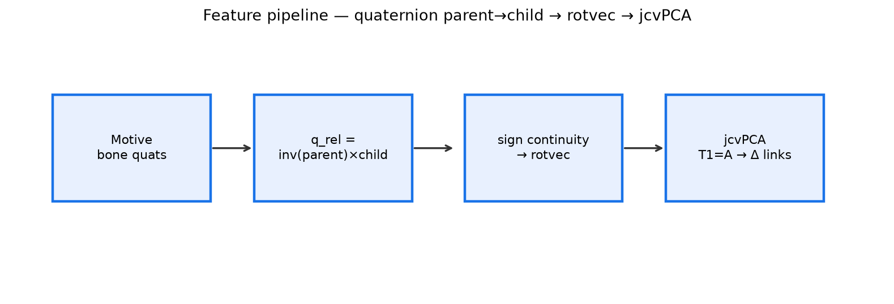
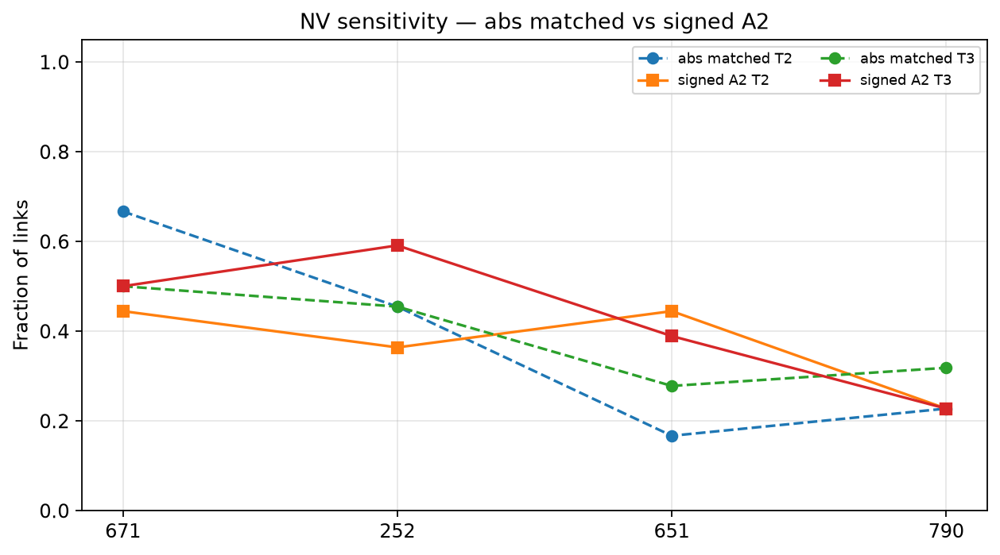
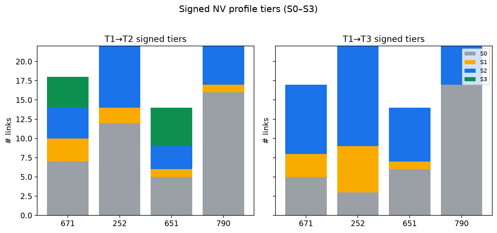
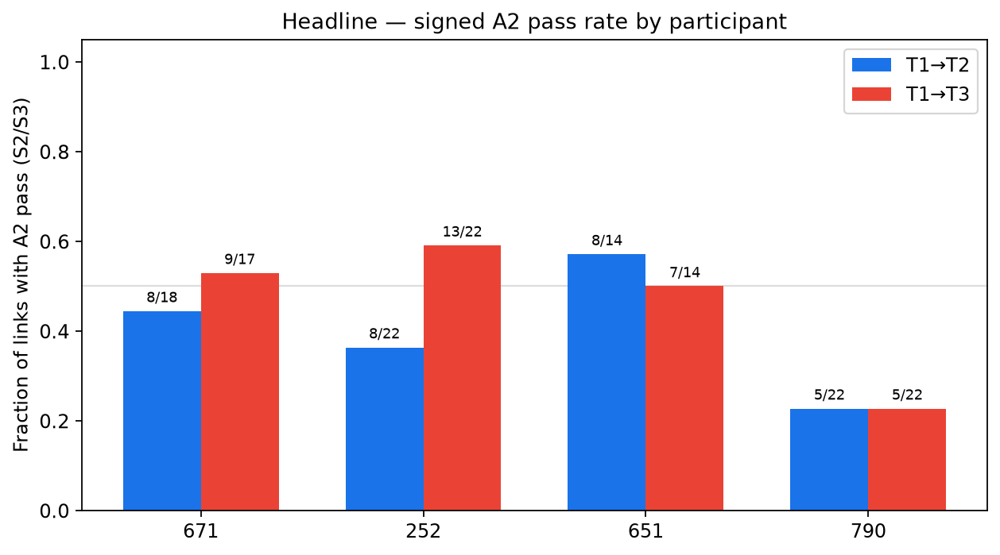
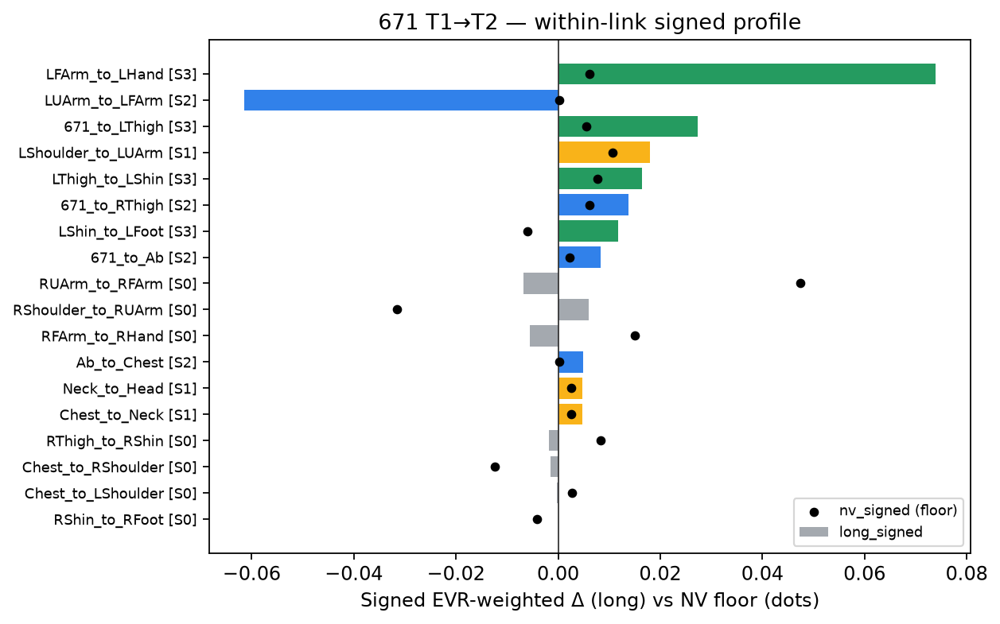
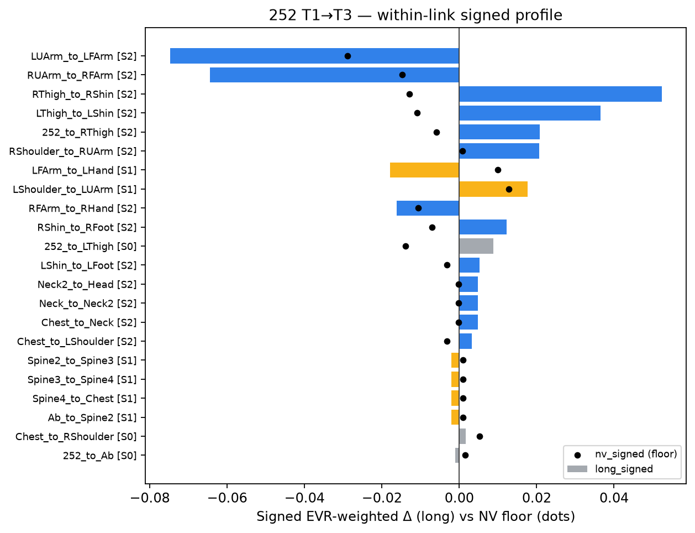
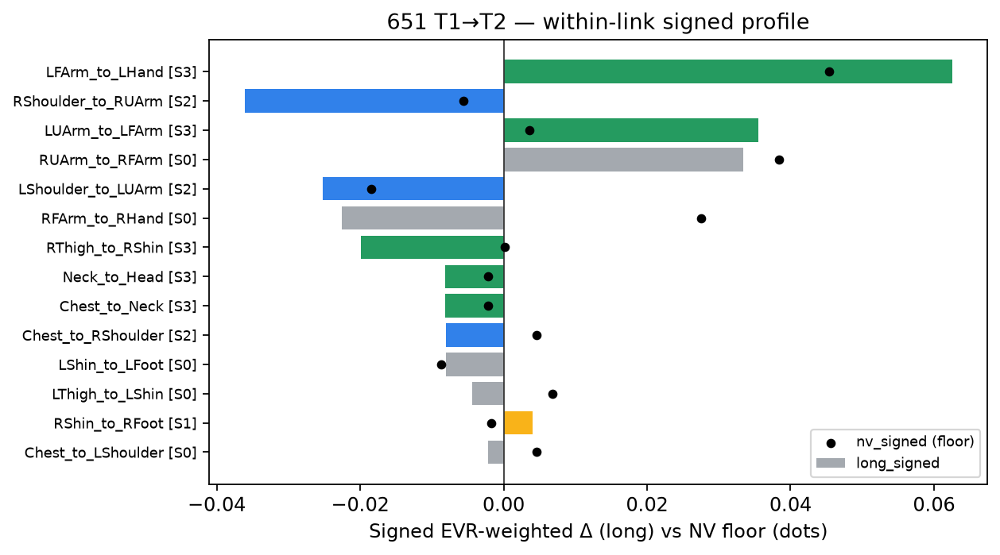
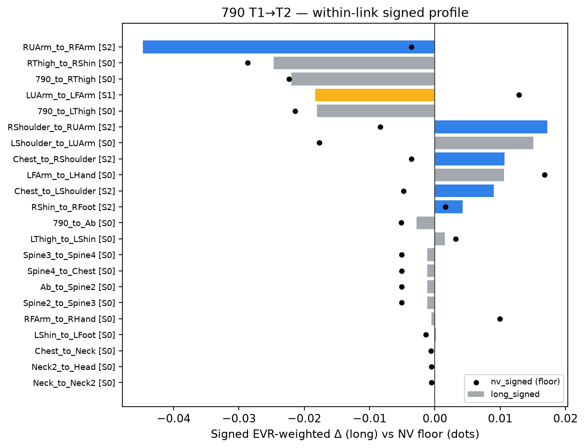
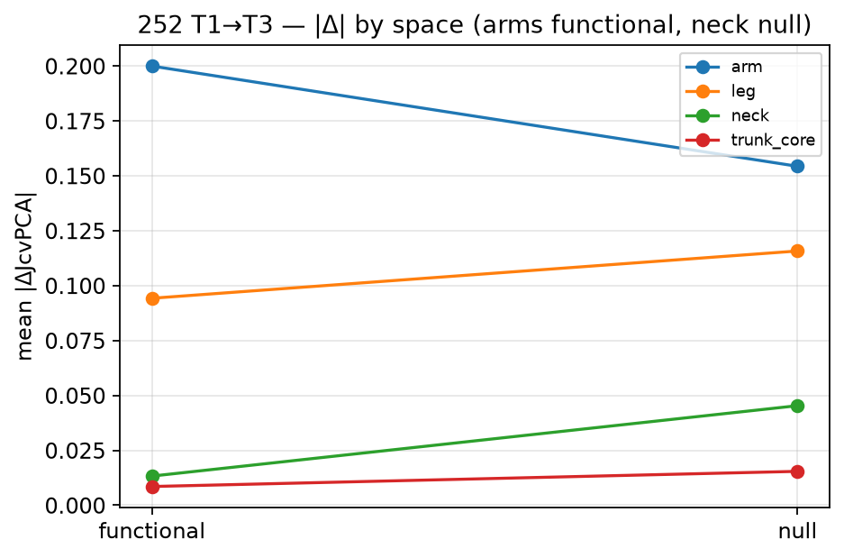

<!-- Companion notes: docs/SUPERVISOR_MEETING_ELABORATION_2026-07-18.md -->
<!-- Figures: docs/supervisor_meeting_figures_2026-07-18/ (see README for slide mapping) -->

# jcvPCA committee case study
## Four N-of-1 dancers — what we did, what we found, what to decide

Supervisor meeting · 2026-07-18  
Participants: **671 · 252 · 651 · 790** · Window: `ex09_13`  
Figures: `docs/supervisor_meeting_figures_2026-07-18/`

---

# One-sentence thesis

In each dancer, **link contribution to shared movement structure** changes from T1 → later timepoints, and for a **subset of links** that change **exceeds that dancer’s own take-to-take improvisation variability** — a conservative, descriptive proxy for broader access to underused degrees of freedom.

**No** causal · **No** population · **No** timing claim

---

# What we ask (scope)

| Ask | Not ask |
|---|---|
| Did coordination **reweight** within T1’s subspace? | Did Gaga/psilocybin **cause** it? |
| Does change beat **own NV** (signed, direction-stable)? | Is this a **group** effect? |
| Is it **organization** (flat ROM) vs amplitude? | Anatomical joint angles / muscles? |
| Where in PC spectrum (functional vs redundant)? | New DOF outside T1 subspace? |

Four **separate N-of-1** analyses — never pooled across people.

---

# Feature pipeline (1/3) — from Motive to links

1. Motive solved-skeleton CSV → **bone quaternions** per frame  
2. For each feasible skeleton edge (**parent → child**):  
   `q_rel = inv(q_parent) × q_child`  
3. Sign continuity along time → **rotation vector** `(rx, ry, rz)`  
4. Low-pass filter in tangent space → analysis features

**Not** anatomical Euler / ISB angles. Relative **link rotvecs**.

---

# Feature pipeline (2/3) — why relative rotvecs

- Paper-faithful jcvPCA input stream (S0 default)
- Measures how a **child segment moves relative to its parent**
- Claims stay on **contribution to shared variance structure** — not “flexion increased”

Optional later: BVH/Euler pilot — only if rotvec QC/interpretability fails

---

# Feature pipeline (3/3) — then jcvPCA

- **T1 = reference A** always  
- T2/T3 = B, projected into T1’s retained PCs (~80% EVR)  
- Per link: `JcvPCA = JRW_B − JRW_A` (signed redistribution)  
- Method sees **reweighting within T1’s subspace**  
- Truly new DOF → **low coverage**, not big Δ

---

# QC — inclusive policy

- Keep **all feasible** parent→child links per skeleton  
- Trunk **mandatory** where bones exist  
- Drop only clearly un-analyzable segments  

| Setup | Participants | Trunk |
|---|---|---|
| A (compact) | 671, 651 | `*_to_Ab`, `Ab_to_Chest` |
| B (extended spine) | 252, 790 | Ab→Spine2→…→Chest |

---

# QC — what passed

| Check | Result |
|---|---|
| Trunk QC (T1 R1) | **PASS** all 4 |
| Caution links | 671: 1 · 651: 4 · 252/790: 0 |
| QC-drop → top-5 | overlap **1.0** everywhere |
| Shared-link drops | 651 trunk missing some T2/T3; 671 T3 marker-prefix caution |

QC does **not** drive the partial-robustness story — **rep-mode** does.

---

# Parameter decisions (1/2) — locked

| Decision | Chosen | Why |
|---|---|---|
| Window | `ex09_13` contiguous | Group4 curvilinear block |
| Features | Relative link rotvecs | Paper-faithful S0 |
| Reference | T1 = A | jcvPCA design |
| PCA VT | **0.80** | Project default; k-grid around m |
| Link set | Full feasible + trunk | Inclusive |

---

# Parameter decisions (2/2) — provisional Phase-0

| Decision | Chosen | Status |
|---|---|---|
| A2 estimand | Single-rep `T1_R1 vs T{k}_R1` | provisional |
| A2 gate | **Signed S2** (mag + direction-stable) | provisional |
| Aggregation | EVR-weighted signed sum | provisional |
| ε_sign | `1e-6` (floor-unstable flag) | provisional |
| S1 | Report, **not** A2 | provisional |
| Headline pooled | Descriptive only (different basis) | locked |

→ Confirm tomorrow in `SUPERVISOR_NV_DECISION.md`

---

# Sensitivity — NV floor

| Check | Finding |
|---|---|
| Pooled vs matched | Matched is stricter (252 T3: **19→10** abs exceed) |
| Abs ratio vs signed S2 | S2 demotes direction-unstable links → **S1** |
| Tiny NV floor | Inflates ratios → `nv_floor_unstable` |
| Coverage | T3 **limited** for 671/252/651 |

**Authoritative A2 = signed S2 on matched single-rep**, not pooled abs count.

---

# Sensitivity — ranking robustness (Step 4b)

| Axis | What it asks |
|---|---|
| **k-grid** | Does top-5 survive changing #PCs? |
| **Rep-mode** | Pooled vs R1/R2 takes agree? |
| **QC-drop** | Caution links driving the story? |
| **p50 band** | Dominant coordination more stable than full 80% ranking? |

Labels: 671/651 mostly **stable** · 252 **partial** both · 790 T3 **partial**

---

# Sensitivity — functional band vs full ranking

- Dominant structure = **3–5 PCs** to 50–60% T1 EVR  
- Full ranking uses 6–10 PCs → secondary modes compete for top-5  
- **252 T3:** full rep overlap 0.4, but **p50 = 1.0** → fringe wobble, not flipped dominant pattern  
- **790 T3:** weak even at dominant band → stronger caution

---

# NV problem — improvisation

Paper NV = many random splits of discrete repeats → **not available here**  
We have **2 improvised takes** per timepoint.

**Our floor:** same-condition R1↔R2 on matched footing  
→ already contains real movement differences → **high bar** (strength)

Within-link: `long vs own NV` — **not** arm |Δ| vs trunk |Δ|

---

# Signed tiers S0–S3 (A2 gate)

| Tier | Rule | Use |
|---|---|---|
| S0 | \|long\| ≤ \|nv\| | within improv spread |
| S1 | mag exceed, direction **not** stable | report, not A2 |
| **S2** | mag exceed **+** reference-direction stable | **A2 minimum** |
| S3 | S2 + coverage + rep + organization | interpretive candidate |

Sign-consistency = stable if anchor is T1_R1 **or** T1_R2

---

# Headline — signed A2 (primary)

| Pid | Links | A2 T2 | A2 T3 | S3 | Coverage T2/T3 | Robust |
|---|---:|---:|---:|---|---|---|
| **671** | 18 | **8/18** | 9/17 | 4 (T2) | ok / limited | stable |
| **252** | 22 | 8/22 | **13/22** | none | ok / limited | partial |
| **651** | 14 eval | **8/14** | 7/14 | 5 (T2) | ok / limited | **stable** |
| **790** | 22 | 5/22 | 5/22 | none | ok / ok | T3 partial |

---

# Case 671 — results

- A2: **8/18** (T2), **9/17** (T3)  
- **S3 (T2):** `671_to_LThigh`, `LFArm_to_LHand`, `LShin_to_LFoot`, `LThigh_to_LShin`  
- **Most persistent:** 6 links hold T2→T3 (71% sign agree)  
- Arm + leg chain lead; trunk `*_to_Ab` / `Ab_to_Chest` pass **S2** under within-link NV (small |Δ|, valid margin)

---

# Case 671 — hedges & role

- T3 coverage **limited**; rep chain-heuristic fails  
- Trunk ratios can look large → check `nv_floor_unstable`  
- **Role:** primary persistent case + has interpretive-grade S3

---

# Case 252 — results

- A2: 8/22 (T2), **13/22** (T3) — broadest T3 signed signal  
- **No S3** (rep gate k-grid 0.4 + T3 coverage limited)  
- Underused-at-T1: **7/8** exceed at T2 (strongest broader-participation signal)  
- Step 5: T3 exceed links **19/19 organization** (flat ROM)

---

# Case 252 — hedges & role

- Partial robustness = **rep-fringe**; dominant p50 stable (T3 p50=1.0)  
- T3 largely **emergent** (10 links), sign-agree only 41%  
- **Null-space neck:** \|Δ\|_null ≈ 3× functional (secondary insight)  
- **Role:** strongest redistribution story — keep interpretive language gated

---

# Case 651 — results

- A2: **8/14** (T2), 7/14 (T3)  
- **S3 (T2):** neck + arm chain + `RThigh_to_RShin` (5 links)  
- **Strongest robustness** (stable both)  
- True trunk links **missing** on some T2/T3 → cannot claim trunk involvement

---

# Case 651 — hedges & role

- Neck often **functional-dominant** (counterexample to null-trunk story)  
- Conservative exceed counts historically; signed A2 still clear at T2  
- **Role:** “not overfitting” case that still clears S3

---

# Case 790 — results

- A2: **5/22** both T2 and T3 — most conservative  
- **No S3**; underused links mostly do **not** increase beyond NV  
- T3 coverage **adequate** (exception) but robustness **partial** at dominant band  
- One extreme floor-unstable ratio (~133×) — do not headline

---

# Case 790 — hedges & role

- Method correctly **refuses** interpretive over-claim  
- **Role:** limits / caution machinery demonstration

---

# Cross-cutting — what holds for all four

1. **A1:** contribution structure changed (all)  
2. **A2 (signed):** subset of links pass S2 (all — counts differ)  
3. Distal **arm chain** among largest changes (convergence observation, not cohort)  
4. **Not global broadening:** entropy / top-1 share ≈ flat (Step 7)  
5. Judge links by **own NV margin**, not cross-link |Δ|

---

# Functional vs null (paper)

> Functional task joints → first **p** PCs  
> Redundant joints → last **(m−p)** PCs

Task = arm-led curves → arms expected in **functional** band  
Subtle axial participation → candidate for **null / redundant** band

**Secondary** thread — does not replace primary A2 story

---

# Null-space insight (secondary)

**252 T1→T3:** arms mainly functional; neck \|Δ\|_null ≈ 0.045 vs fun ≈ 0.013  

Also supportive: 252 T2, 790 T3 neck null-dominant; 671 T2 trunk/neck  

**Counterexample:** 651 neck is **functional-dominant**  

→ Consistent with subtle redundant-joint story in *some* cases — not universal

---

# What we CAN claim

- Within-person redistribution of link contribution (A1)  
- Signed direction-stable exceed of own NV for a subset (A2 = S2)  
- Organization-type where ROM flat (esp. 252 T3)  
- Link-specific reweighting, **not** whole-body entropy shift  
- Cautious interpretive “underused / broader” only where S3 (671/651 T2) + supervisor

---

# What we CANNOT claim

- Causality (blinded, no control)  
- Population / cross-participant effect  
- Statistical significance  
- Global “body opening”  
- New DOF outside T1 subspace  
- Timing / segmentation / muscle / anatomical angles  
- Trunk became the **main** task effector

---

# Future questions — direction

1. Confirm Phase-0 signed NV locks?  
2. A3 interpretive only for S3 candidates?  
3. Deepen **null-only NV** as secondary estimand?  
4. Adopt within-link NV wording for committee?  
5. Stay on rotvecs (S0) — reopen BVH pilot?  
6. Run Layer 2 subsample stability?  
7. Which cases feature as primary / counterweight / limits?  
8. Thesis methods note vs more case results next?

---

# Decisions needed today

1. Sign off / amend `SUPERVISOR_NV_DECISION.md`  
2. Interpretive language: S3 only?  
3. Null-space thread: show / deepen / hold  
4. Case featuring plan for committee brief  
5. Next milestone: Step 10 findings summary vs methods note

---

# Sources (all numbers traceable)

`METRICS_DIGEST.md` · `NV_PROFILE.csv` · `coverage.csv` · `robustness.csv`  
`functional_pc_bands.csv` · `step05…/classification_summary.md`  
`step06_underused_at_t1/` · `step07_contribution_distribution/` · `step09_persistence_t2_t3/`  
`rotations.py` · `nv_profile.py` · `SUPERVISOR_NV_DECISION.md`

**Elaboration (speak from this):**  
`docs/SUPERVISOR_MEETING_ELABORATION_2026-07-18.md`

**All figures (by slide block):**  
`docs/supervisor_meeting_figures_2026-07-18/README.md`
